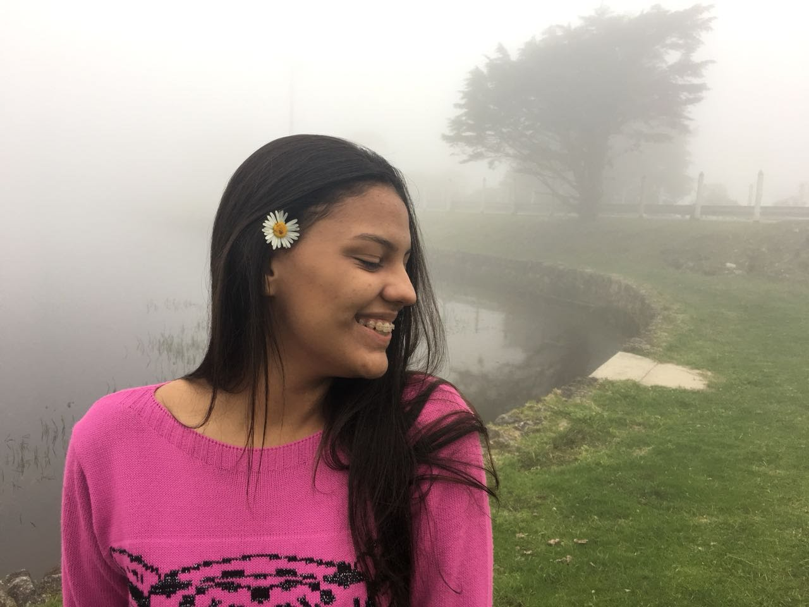
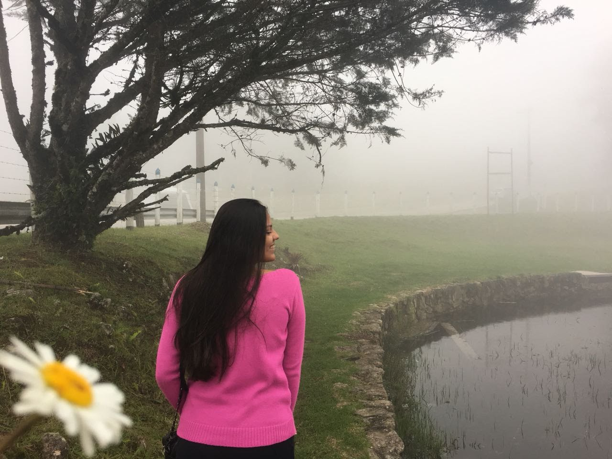
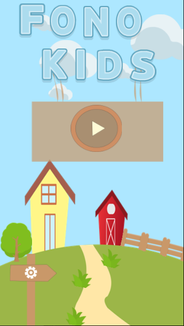
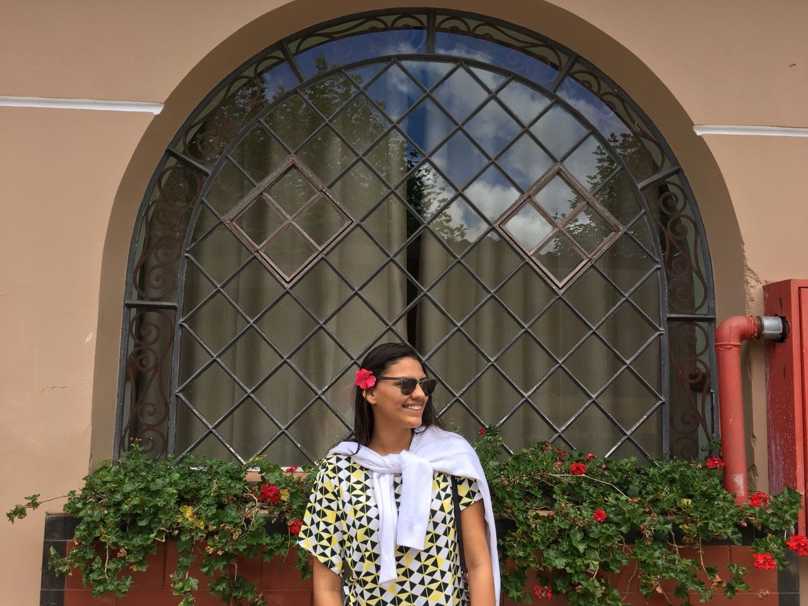

--
layout: default
---
   ### **_SOBRE_**

**Jordana Silveira**
   
Jordana Siveira Gomes, sou uma pobre estudante (rs), moro em João cãmara,RN.
   
Criei este blog para compartilhar os meus projetos realizados durante o ano letivo de 2017 para a disciplina de Oficina de Criação.  

**Formação acadêmica**

* Curso técnico em Programação de Jogos Digitais, pelo IFRN, campus Ceará-Mirim. (Cursando)

**Contato**

#Portfolio

## GAMES

#### 

## Artes

## Apresentações
* Aula de Multimidia
* Aula de Motores
* Aula de Game Design

1. Durval
2. Marcelo
3. Thiago

## Projetos

* *

** negrito

_ italico

~~ riscado

   dois espaço p/ pular linha
 3* adciona uma linha horizontal
 #s uma ou mais hashtag criam capitulos ou sub capitulos
 *s asteriscos adciona uma lista não numerada
 1s numeros adcionam uma lista numerada
 
 * * *
