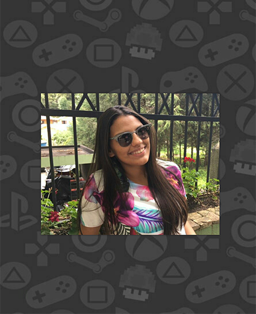
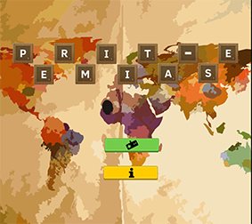
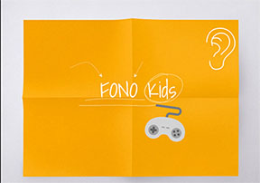
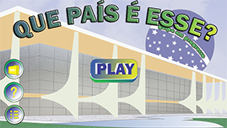
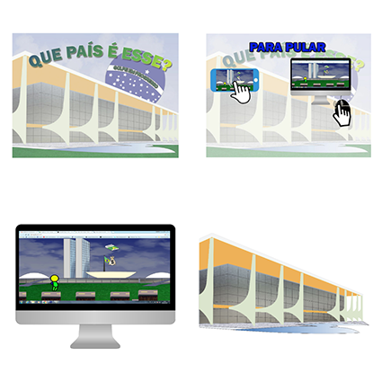
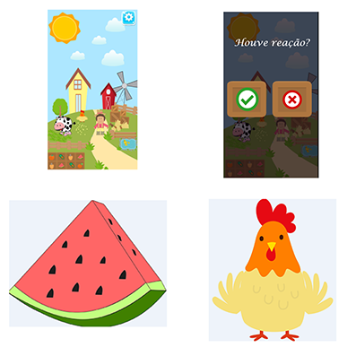

# SOBRE

**_Jordana Silveira_**
   
Jordana Siveira Gomes, sou uma pobre estudante (rs), moro em João cãmara,RN.
   
Criei este site para compartilhar os meus projetos realizados durante o ano letivo de 2017 para a disciplina de Oficina de Criação. Tenho objetivos futuros em relação a este site que é de compartilhar também sobre minhas experiências dentro do IFRN e curiosidades e diversas outras coisas sobre o meu curso e aréa de Jogos Diitais.

# **Formação acadêmica**

***

* Curso técnico em Programação de Jogos Digitais, pelo IFRN, campus Ceará-Mirim,RN. (Cursando)

# **Contato**

***

e-mail: jordanagomes51@gmail.com

Instagram: @_jordanasg

   

## Portfolio:

# PROJETOS

* **Permita-se**

O jogo Permita-se foi apresentado como requisito para a obtenção de nota do 1° bimestre da disciplina de Oficina de criação, componente curricular do curso técnico de Programação de Jogos Digitais, pelo IFRN, campus Ceará-Mirim.

_Objetivo do jogo_

Fazer com que os jogadores se permita conhecer outras culturas, costumes etc.

*  **FonoKids**

Protótipo do jogo Fono Kids apresentado como requisito parcial para a obtenção de nota do 2° bimestre da disciplina de Oficina de criação, componente curricular do curso técnico de Programação de Jogos Digitais, pelo IFRN, campus Ceará-Mirim.

_Objetivo do Jogo_

Cooperar para o processo terapêutico da reabilitação auditiva do paciente de uma forma mais dinâmica, expondo a importância dessa ferramenta no ambiente de trabalho do fonoaudiólogo através de um protótipo de jogo “Fono Kids”.

*  **Que país é esse?**

Este jogo foi apresentado como quesito para atingir a nota do 3° bimestre da disciplina de Oficina de criação.

_Objetivo do jogo_

O jogo tem como objetivo fazer com que os jovens, através dos jogos digitais, se interessem pelo assunto e possam fazer a diferença no país.

# JOGOS

> Permita-se:
>[https://zevictor.github.io/Permita-se/](Permita-se Game).
>
> FonoKids:
>[Jordanag.github.io/FonoKids2/](FonoKids Game).
>
> Que País é esse 
>[https://cavalcantebya.github.io/quepaiseesse/](QuePaiEssse Game).

# ARTES

