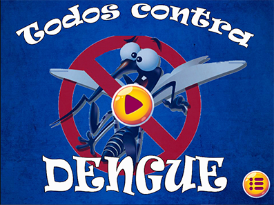
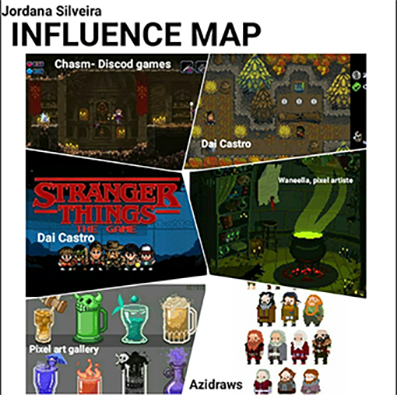

# SOBRE

**_Jordana Silveira_**
   
Jordana Siveira Gomes, sou uma pobre estudante (rs), moro em João cãmara,RN.
   
Criei este site para compartilhar os meus projetos realizados durante o ano letivo de 2017 para a disciplina de Oficina de Criação do professor Marcelo Barros. Tenho objetivos futuros em relação a este site que é de compartilhar também sobre minhas experiências dentro do IFRN e curiosidades e diversas outras coisas sobre o meu curso e a aréa de Jogos Diitais.

Seja bem-vindo!

# **Formação acadêmica**

***

* Curso técnico em Programação de Jogos Digitais, pelo IFRN, campus Ceará-Mirim,RN. (Cursando)

# **Contato**

***

e-mail: jordanagomes51@gmail.com

Instagram: @_jordanasg

   

## Portfolio:
   
   
# PROJETOS
   
   
* **Permita-se**

O jogo Permita-se foi apresentado como requisito para a obtenção de nota do 1° bimestre da disciplina de Oficina de criação, componente curricular do curso técnico de Programação de Jogos Digitais, pelo IFRN, campus Ceará-Mirim.

_Objetivo do jogo_

Fazer com que os jogadores se permita conhecer outras culturas, costumes etc.

_Tema do jogo:_  Cultura

*  **FonoKids**

Protótipo do jogo Fono Kids apresentado como requisito parcial para a obtenção de nota do 2° bimestre da disciplina de Oficina de criação, componente curricular do curso técnico de Programação de Jogos Digitais, pelo IFRN, campus Ceará-Mirim.

_Objetivo do Jogo_

Cooperar para o processo terapêutico da reabilitação auditiva do paciente de uma forma mais dinâmica, expondo a importância dessa ferramenta no ambiente de trabalho do fonoaudiólogo através de um protótipo de jogo “Fono Kids”.

_Tema do jogo:_  Mensagem

*  **Que país é esse?**

Este jogo foi apresentado como quesito para atingir a nota do 3° bimestre da disciplina de Oficina de criação.

_Objetivo do jogo_

O jogo tem como objetivo fazer com que os jovens, através dos jogos digitais, se interessem pelo assunto e possam fazer a diferença no país.

_Tema do jogo:_ Livre

# Projeto Integrador

   O jogo-tower defense está ligado ao combate contra a Dengue e tem o objetivo de não permitir que os mosquitos cheguem na torre final e para isso,  durante cada fase, novas armadilhas são dadas para que você consiga cumprir a meta de cada nível, meta essa que foi dita anteriormente. As armadilhas são: inseticida, uma raquete e um veneno. A ideia é mostrar as crianças o perigo que esse mosquito pode causar e como podemos evita-lo. 
   
 
      
   

# JOGOS

> Permita-se:
>[https://zevictor.github.io/Permita-se/](Permita-se Game).
>
> FonoKids:
>[Jordanag.github.io/FonoKids2/](FonoKids Game).
>
> Que País é esse 
>[https://cavalcantebya.github.io/quepaiseesse/](QuePaiEssse Game).
      
   
   

# ARTES

 
* Algumas artes do "Que pais é esse"

* Algumas Artes do "FonoKids"

* Mapa de influencia, trabalho proposto pelo Professor Marcelo com intuito de expor as nossas "influencias".
   
   
# APRESENTAÇÕES
   
  * Epo games(2016), UFRN-IMD, evento voltado ao estudo do desenvolvimento e do uso de jogos digitais e mídia digital interativa.
   
  * III Encontro de Informática do Agreste Potiguar(2018), IFRN Nova Cruz, Apresentação do prototipo de jogo do FonoKids.
     
   
   
     
    
 # Agradecimentos
   
   * Ao Professor Marcelo Barros pelas suas orientações, ensinamentos e brincadeiras durante esses anos que tem passado conosco.
   
   * Ao Instituto IFRN pela oportunidade de fazer o curso.
   
   * E, a você que tirou um tempinho para visitar este site. Espero que tenha gostado.
   
   
      
   
   "Seja forte e corajoso!"
   Josué 1:9
   
   
   

   

